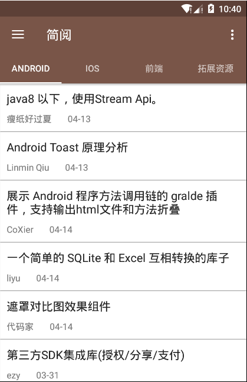
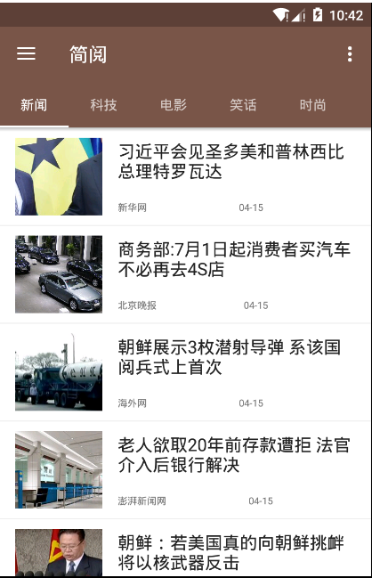
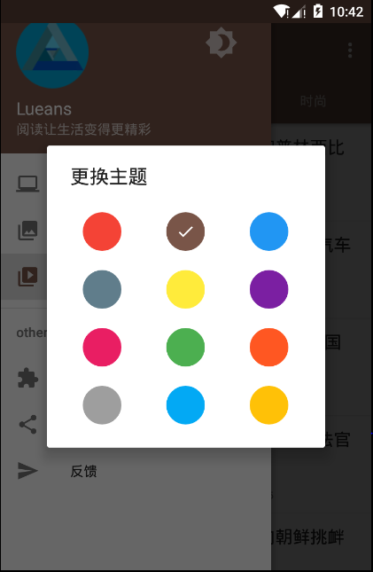
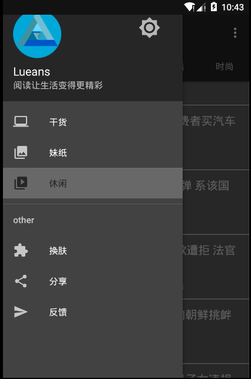

# LueansRead
一款基于Google Material Design设计开发的Android客户端，包括新闻简读，图片浏览和IT干货等3个子模块。项目采用MVP架构，结合RXJava和Retrofit等等主流框架开发。

寒假闲下来学习知识点向大神们学习的一个项目 

每天分享一些IT知识（gank）！SO妹纸图片（360图片）！还有实时的新闻资讯（网易新闻） 
数据来源 
[Gank.Io](http://gank.io/) 
[SO妹纸图片](http://image.so.com/?src=tab_web) 
[新闻资讯](http://news.163.com/) 
（附：图片和新闻数据，都是个人通过数据抓包得来！如有侵权，请告知！我会及时下架！[联系方式](http://weibo.com/5599619390/profile?rightmod=1&wvr=6&mod=personinfo)） 

[直接下载](https://fir.im/r7ts) 
欢迎使用向我修功能提建议改bug 
相关文章：http://hugeterry.cn/dreams/324

 

 

#### 主要运用
- `Material Design`
- [Retrofit2](https://square.github.io/retrofit/) RESTful API库与响应式编程[Rxjava](https://github.com/ReactiveX/RxJava)结合
- [DBflow](https://github.com/Raizlabs/DBFlow)数据库
- [Glide](https://github.com/bumptech/glide) 图片加载
- `RecyclerView`实现listview以及实现瀑布流布局
- `WebView`

## 特别鸣谢

- [@代码家](http://weibo.com/u/1628291124)和他的[干货集中营](http://gank.io)提供的数据
- [@hugeterry](http://weibo.com/drak11t)和他的[coderfun](https://github.com/hugeterry/coderfun)
- [@WuXiaolong](http://wuxiaolong.me)和他的[Android DesignSupportLibrary实例](https://github.com/hugeterry/coderfun)

## 开源协议

[GPL v3](LICENSE)
